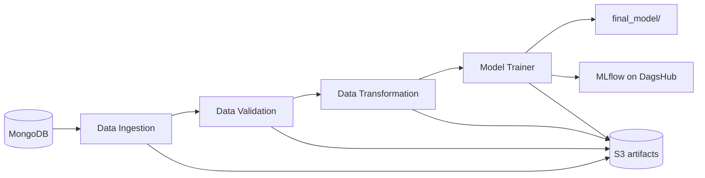
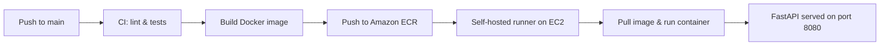

# 🛡️ Network Security — Phishing Website Detection

An end-to-end machine learning project that classifies a website as **phishing** or **legitimate** from 30 URL, HTML and domain features, served through a **FastAPI** app and shipped to **AWS** (ECR + EC2) through a **GitHub Actions CI/CD pipeline** with **Docker**.

<p align="left">
  
  
  
  
  
  <br>
  
  
  
  
  
  
</p>

---

## 📌 Overview

Given 30 features describing a website (IP address in URL, URL length, SSL state, anchor-tag behaviour, domain age, web traffic, page rank and more), the model predicts whether the site is **phishing** or **legitimate**.

The project follows a modular, production-style ML layout — **ingestion → validation → transformation → training → prediction** — with typed config/artifact entities, custom logging and exception handling, experiment tracking, and cloud sync of every run's artifacts to S3.

---

## 🧰 Tech Stack

| Layer | Tools |
|---|---|
| Language |  |
| API Framework |   |
| Data Handling |   |
| Modeling |  |
| Database |  |
| Experiment Tracking |   |
| Serialization | `dill` |
| Containerization |  |
| CI/CD |  |
| Cloud |  |

---

## 📂 Project Structure

```
├── app.py                          # FastAPI app (/train, /predict)
├── main.py                         # run the training pipeline step by step
├── push_data.py                    # CSV → MongoDB loader
├── test_mongodb.py                 # MongoDB connection check
├── Dockerfile
├── requirements.txt
├── setup.py
├── .github/workflows/main.yml      # CI/CD: build → ECR → deploy
├── data_schema/schema.yaml         # expected columns & dtypes
├── Network_data/phisingData.csv    # source dataset
├── notebooks/
│   ├── 01_EDA.ipynb                # exploratory data analysis
│   └── 02_model_training.ipynb     # model comparison & selection
├── networksecurity/
│   ├── cloud/s3_syncer.py          # aws s3 sync helper
│   ├── components/
│   │   ├── data_injestion.py       # MongoDB → CSV, dedupe, train/test split
│   │   ├── data_validation.py      # schema checks + KS drift report
│   │   ├── data_transformation.py  # KNN imputer pipeline → .npy arrays
│   │   └── model_trainer.py        # tunes 10 classifiers, logs to MLflow
│   ├── constant/training_pipeline/ # all pipeline constants
│   ├── entity/                     # config_entity.py, artifact_entity.py
│   ├── exception/exception.py      # custom exception
│   ├── logging/logger.py           # timestamped file logger
│   ├── pipeline/training_pipeline.py
│   └── utils/                      # main_utils + ml_utils (metrics, NetworkModel)
├── templates/table.html            # prediction results table
├── Artifacts/<timestamp>/          # generated: per-run data, drift report, models
├── final_model/                    # generated: preprocessor.pkl + model.pkl (served)
├── prediction_output/output.csv    # generated: latest batch predictions
└── logs/                           # generated: per-run log files
```

---

## 📊 Dataset

Each row is one website. All 30 features are categorical codes (`-1`, `0`, `1`).

| Group | Example features |
|---|---|
| URL-based | `having_IP_Address`, `URL_Length`, `Shortining_Service`, `having_At_Symbol`, `Prefix_Suffix`, `having_Sub_Domain` |
| HTML / JavaScript | `Request_URL`, `URL_of_Anchor`, `Links_in_tags`, `SFH`, `on_mouseover`, `RightClick`, `popUpWidnow`, `Iframe` |
| Domain-based | `SSLfinal_State`, `Domain_registeration_length`, `age_of_domain`, `DNSRecord`, `web_traffic`, `Page_Rank`, `Google_Index` |
| **Target** | `Result` — `-1` = phishing, `1` = legitimate |

**Data quality finding:** the raw file has **11,055 rows**, but **5,206 are exact duplicates**, leaving **5,849 unique websites** (51.6 % phishing / 48.4 % legitimate). Keeping duplicates leaks test rows into training — in the notebook experiment, 64.6 % of test rows were copies of training rows and accuracy was inflated from 94.0 % to 97.7 %. Duplicates are therefore removed during ingestion.

---

## 🔧 ML Pipeline



**1. Data Ingestion** (`data_injestion.py`)
Reads the collection from MongoDB, drops `_id`, converts `"na"` to `NaN`, logs a data-quality summary, removes duplicate rows, saves a feature-store copy, and performs an 80/20 train-test split.

**2. Data Validation** (`data_validation.py`)
Checks the incoming data against `data_schema/schema.yaml` (column counts) and runs a **Kolmogorov–Smirnov two-sample test** per feature (p-value threshold `0.05`) between train and test to detect drift. The result is written to `drift_report/report.yaml`.

**3. Data Transformation** (`data_transformation.py`)
Builds a preprocessing `Pipeline` with a **`KNNImputer`** (`n_neighbors=3`), maps the target from `-1 → 0`, and writes transformed `train.npy` / `test.npy` arrays plus the fitted `preprocessing.pkl`.

**4. Model Training & Selection** (`model_trainer.py`)
Ten classifiers are tuned with `GridSearchCV` (cv=3) and the best one is picked by test-set score (it must clear an expected score of `0.6`). Precision, recall and F1 are logged to **MLflow on DagsHub**, and the winning model plus preprocessor are saved to `final_model/`.

**5. Cloud Sync** (`s3_syncer.py`)
After each run, `Artifacts/<timestamp>/` and `final_model/` are synced to an S3 bucket with `aws s3 sync`.

**6. Prediction** (`app.py`)
Loads `final_model/preprocessor.pkl` and `final_model/model.pkl`, wraps them in `NetworkModel`, and predicts for every row of an uploaded CSV.

---

## 🤖 Models & Hyperparameter Tuning

The pipeline tunes these ten models with `GridSearchCV`:

| Model | Hyperparameters Searched |
|---|---|
| Logistic Regression | `C` |
| K-Nearest Neighbors | `n_neighbors`, `weights` |
| SVM (RBF) | `C`, `gamma` |
| Naive Bayes (Gaussian) | `var_smoothing` |
| MLP (Neural Net) | `hidden_layer_sizes`, `alpha` |
| Decision Tree | `criterion`, `max_depth` |
| Random Forest | `n_estimators`, `max_depth` |
| Extra Trees | `n_estimators`, `max_depth` |
| AdaBoost | `learning_rate`, `n_estimators` |
| Gradient Boosting | `learning_rate`, `subsample`, `n_estimators` |

### Results from the latest pipeline run

| Split | F1 | Precision | Recall |
|---|---|---|---|
| Train | 0.9664 | 0.9603 | 0.9726 |
| **Test** | **0.9514** | **0.9522** | **0.9505** |

### Notebook study (`02_model_training.ipynb`)

A fuller, leak-free comparison of 12 models + 2 ensembles using 5-fold stratified CV, scored once on a held-out 1,170-site test set:

| Model | CV F1 (tuned) | Test F1 |
|---|---|---|
| Gradient Boosting | **0.9538** | 0.9531 |
| SVM (RBF) | 0.9534 | 0.9581 |
| Soft Voting (top 5) | 0.9533 | 0.9548 |
| Extra Trees | 0.9529 | 0.9435 |
| XGBoost | 0.9516 | 0.9575 |
| Logistic Regression | 0.9391 | 0.9349 |

**Key takeaways**
- The top eight models sit within roughly one standard deviation of each other — the ranking among them is mostly noise at this dataset size.
- **`URL_of_Anchor` and `SSLfinal_State`** are by far the most important features (permutation importance); using all 30 features beats any smaller subset.
- Lowering the decision threshold to `0.2` raises phishing recall from 94.2 % to 97.5 % (missed phishing sites drop from 35 to 15) at the cost of more false alarms — a useful trade-off for a security use case.

---

## 🌐 API Endpoints

| Method | Route | Description |
|---|---|---|
| `GET` | `/` | Redirects to the interactive Swagger docs at `/docs` |
| `GET` | `/train` | Runs the full training pipeline and syncs artifacts to S3 |
| `POST` | `/predict` | Upload a CSV of website features → returns an HTML table with a `predicted_column` and saves `prediction_output/output.csv` |

The uploaded CSV must contain the 30 feature columns from `data_schema/schema.yaml` (without `Result`).

---

## 🚀 Deployment — CI/CD to AWS (ECR + EC2)



- **Trigger:** a push to `main` (changes to `README.md` are ignored).
- **Continuous Integration:** checkout, lint and unit-test steps.
- **Continuous Delivery:** the Docker image is built and pushed to **Amazon ECR**.
- **Continuous Deployment:** a **self-hosted runner** pulls the latest image, removes the old container, and runs the new one with `-p 8080:8000`.
- **Secrets** (set in GitHub → Settings → Secrets): `AWS_ACCESS_KEY_ID`, `AWS_SECRET_ACCESS_KEY`, `AWS_REGION`, `ECR_REPOSITORY_NAME`, `MONGO_DB_URL`, `DAGSHUB_USER_TOKEN`.

```dockerfile
FROM python:3.11-slim
WORKDIR /app
COPY . /app
RUN apt update -y && apt install awscli -y
RUN apt-get update && pip install -r requirements.txt
CMD ["python3", "app.py"]
```

---

## ⚙️ Installation & Local Usage

```bash
# 1. Clone the repo
git clone https://github.com/samsure13003/Network_security.git
cd Network_security

# 2. Create and activate a virtual environment
python -m venv venv
source venv/bin/activate      # Windows: venv\Scripts\activate

# 3. Install dependencies
pip install -r requirements.txt

# 4. Create a .env file in the project root
#    MONGO_DB_URL=<your MongoDB connection string>
#    DAGSHUB_USER_TOKEN=<your DagsHub token>   (for MLflow tracking)

# 5. Load the dataset into MongoDB (one time)
python push_data.py

# 6. Run the training pipeline (creates Artifacts/ and final_model/)
python main.py

# 7. Launch the API
python app.py
```

Then open **http://localhost:8000** (it redirects to `/docs`) to trigger `/train` or upload a CSV to `/predict`.

---

## 📈 Possible Improvements

- Add real unit tests and a linter to the CI job (the steps are currently placeholders)
- Add a decision-threshold option to `/predict` for a recall-oriented setting
- Return predictions as JSON alongside the HTML table
- Add a model-evaluation gate so a new model replaces `final_model/` only if it beats the current one
- Add a `/predict` form for a single URL, with feature extraction from the raw URL
- Replace `os.system("aws s3 sync")` with `boto3` for better error handling

---

## 👤 Author

**Samsure Rahman**
📧 samsurerahman13003@gmail.com

---

## 📄 License

This project is available under the [MIT License](LICENSE).
